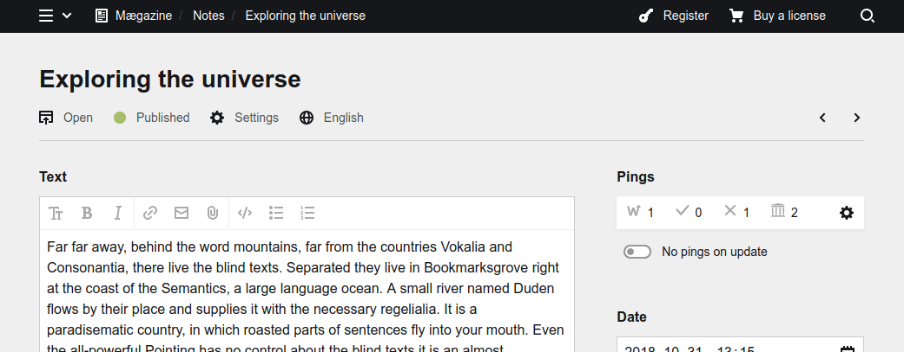
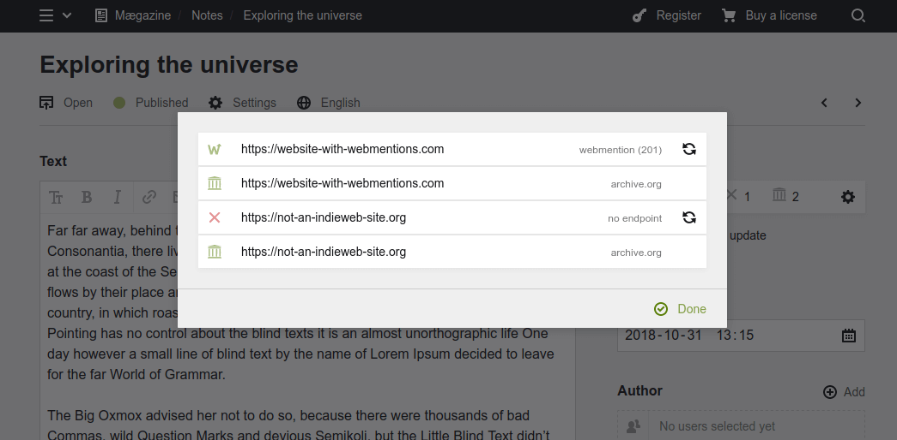

🛑 This project has been archived and is **no longer maintained**. Feel free to fork it or build something awesome on top of it – it's MIT-licensed, so you're pretty free to do whatever you fancy. As-is, the archived version has not been tested beyond Kirby 3.3; it probably has severe issues beyond version 3.5 and likely won't work with PHP 8.

# Kirby 3 Sendmentions

The plugin can be set up to send [Webmentions](https://www.w3.org/TR/webmention/) to all URLs linked from a page's content. This notifies the receiving sites that they have been linked to, and allows them to display these, if desired. If the target site does not provide a webmention endpoint, sending a pingback is attempted instead. As an additional option, the plugin can also request all linked pages to be archived on archive.org (option disabled by default; see [Options](#saving-linked-pages-to-archiveorg) below).

Most websites that receive webmentions will not only verify the link, but parse the source page in order to determine post title, author info etc. Therefore, using the appropriate microformat markup - [h-entry](https://indieweb.org/h-entry) for blog posts - in your templates is strongly recommended.

> The defaults and settings parameters have changed significantly from previous versions (0.x, before June 2020). When updating to the most recent version, changes to blueprints and config settings are required; the most significant change is that the new version is off by default and has to be activated for specific templates, to ensure better control over data flows.

*NB. This plugin only covers outgoing webmentions (notifying other websites linked in your content). Receiving webmentions from other sites and displaying them in page templates requires a separate solution, such as [Kirby 3 Commentions](https://github.com/sebastiangreger/kirby3-commentions).*

## Installation

### Composer

```bash
composer require sgkirby/sendmentions
```

### Git submodule

```bash
git submodule add https://github.com/sebastiangreger/kirby3-sendmentions.git site/plugins/kirby3-sendmentions
```

### Download

Download and copy this repository to `/site/plugins/kirby3-sendmentions`.

## Setup

The plugin has to be activated for specific template types by defining their names in `site/config/config.php` as follows:

```php
// the templates that sending pings should be allowed for
'sgkirby.sendmentions.templates' => ['default', 'note'],
```

If you want to also send the optional archivation requests to archive.org, set up the applicable template names in similar manner (this currently only works for templates the plugin has been activated for):

```php
// the templates that should request links to be archived
// (has to be a subset of those in the .templates setting)
'sgkirby.sendmentions.archiveorg' => ['default', 'note'],
```

To display and manage the sending of mentions for a page in the Panel (technically optional, but highly recommended for better control), add the following to the according blueprint in `site/blueprints/pages`:

```yaml
sections:
  sendmentions:
    type: sendmentions
```

The panel section presents a small counter of sent mentions (from left to right: successfully sent webmentions, sent pingbacks, sites with no compatible enpoint, links archived on archive.org) as well as a switch to override the default setting whether pings are sent on publish/update or not:



Clicking on the cog wheel icon opens a dialog field that provides a detailed list of sent pings; while clicking on an archived item leads to the archived copy on archive.org, notifications to webmention/pingback targets can be retriggered by clicking the refresh icon:



By default, publishing or updating a page (of a template type that the plugin has been activated for) does not automatically trigger the sending of notifications. Instead, "ping on publish" and "ping on update" can be activated for every page individually. To change the global default - i.e. auto-trigger the notifications for all templates (and allow to deactivate them individually) - set one or both of the following variables to `true`:

```php
// sets default to: send pings on page publication unless disabled for a page
'sgkirby.sendmentions.pingOnPublish' => true,
// sets default to: send pings on page update unless disabled for a page
'sgkirby.sendmentions.pingOnUpdate' => true,
```

Sending webmentions and pingbacks at the time of publishing/updating a page leads to a significant delay in the panel (with a dozen or more links in an article, the UI may seem "frozen" for minutes, as polling all the linked pages can take a long time). To avoid this, the plugin's default is asynchronous processing using a queue backlog. In order to purge the queue, a cronjob should regularly call the URL `https://<YOUR-SITE-URL>/sendmentions-processqueue?token=<YOUR-TOKEN>`.

The secret token key is set up using the following config variable; it has to consist of at least 10 alphanumeric characters and may NOT include any of the following: `&` `%` `#` `+` nor a space sign ` `:

```php
// the token to protect the cronjob target
'sgkirby.sendmentions.secret' => '<YOUR-SECRET>',
```

_N.B. Any attempt to trigger the queue process before you set a valid secret in your `config.php` will lead to an error._

For the time being, the plugin still supports setting up the synchronous sending of notifications (this will likely be removed in a later version). This is strongly discouraged due to the poor user experience, but you may disable the asynchronous queue and cronjob setup by setting this variable:

```php
// disables the cronjob queue and sends pings instantly instead
// (causes long delays in panel UI; not recommended and soon to be removed)
'sgkirby.sendmentions.synchronous' => true,
```

In case your site uses virtual pages: If virtual pages are not created through the Kirby panel (e.g. virtual pages generated from a database or CSV file), the sending of webmentions needs to be triggered separately by calling this function with the according Kirby Page object as variable:

```php
// triggering the enqueue/send process for a Page object
\sgkirby\SendMentions\SendMentions::send($page);
```

## Options

The plugin can be configured in your `site/config/config.php`:

| Option | Default | Description |
|---|---|---|
| `sgkirby.sendmentions.templates` | [] | By default, no webmentions are sent for any pages; to activate the sending for specific templates, add the template names to this variable. |
| `sgkirby.sendmentions.archiveorg` | [] | Linked URLs are only sent to archive.org for the templates specified in this array (need to be templates contained in the `templates` array). |
| `sgkirby.sendmentions.pingOnPublish` | false | If set to true, publishing a page triggers sending notification by default (can be overriden on a per-page-basis in the panel). |
| `sgkirby.sendmentions.pingOnUpdate` | false | If set to true, updating an already published page triggers sending notification by default (can be overriden on a per-page-basis in the panel). |
| `sgkirby.sendmentions.synchronous` | false | [To be deprecated] If set to true, notifications are sent immediately rather than stored in a queue to be purged with a cronjob. This leads to a UI freeze in the panel for pages with many links and is not advisable. |
| `sgkirby.sendmentions.secret` | | The secret token to authenticate the cronjob trigger URL. An alphanumeric string of at least 10 characters and NOT including `&` `%` `#` `+` nor a space sign ` `. |


## Features

### Plugin features

- [x] only active for specified templates
- [x] only sending notifications for pages with status "listed"
- [x] sending webmentions asynchronously to avoid lag in panel when saving
- [x] customizable defaults for sending notifications on publishing and/or updating a page
- [x] fall back to sending Pingback, if no Webmention endpoint present
- [x] store target URL, timestamp, and HTTP reponse code for every webmention sent
- [x] comprehensive display of sent webmentions in panel (with manual resend options)
- [x] ping archive.org with target URLs (optional, off by default)
- [ ] passes all 23 endpoint discovery tests on [webmention.rocks](https://webmention.rocks) (#23 still missing)

### Roadmap/Ideas

- [ ] resend webmentions after editing content ("update" webmentions; currently disabled to avoid spamming on fast-paced edits - can be buffered in asynchronous process)
- [ ] send webmentions for deleted posts (or posts changed to other status than "listed"?)
- [ ] send webmentions to URLs removed from content
- [ ] find and implement best URL regex to scan for URLs in content
- [ ] look for URLs in (customizable) fields other than the main content
- [ ] reuse cached endpoint URLs for time period defined by HTTP headers
- [ ] implement a size limit; not sending webmentions for extraordinarily huge pages

## Requirements

[Kirby 3.3+](https://getkirby.com)

## Credits

Inspiration and code snippets from:

- https://github.com/bastianallgeier/kirby-webmentions
- https://github.com/sebsel/seblog-kirby-webmentions

Included vendor libraries:

- https://github.com/indieweb/mention-client-php
- https://github.com/microformats/php-mf2

## License

Kirby 3 Sendmentions is open-sourced software licensed under the [MIT license](https://opensource.org/licenses/MIT).

Copyright © 2020 [Sebastian Greger](https://sebastiangreger.net)

It is discouraged to use this plugin in any project that promotes the destruction of our planet, racism, sexism, homophobia, animal abuse, violence or any other form of hate speech.
